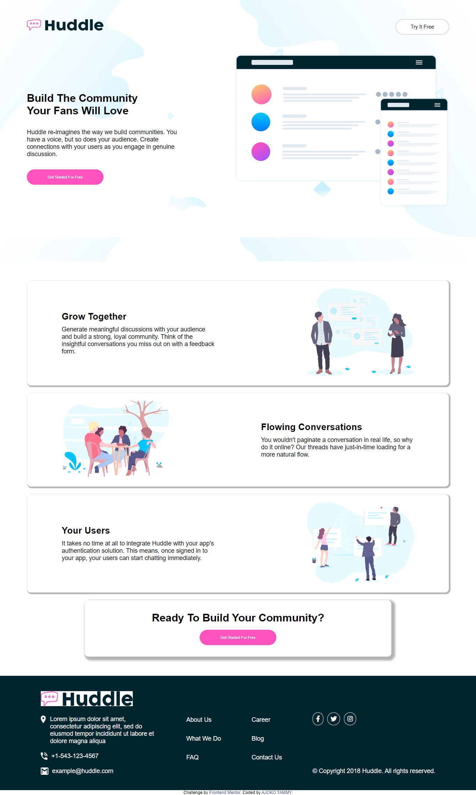

# Frontend Mentor - Huddle landing page with alternating feature blocks solution

This is a solution to the [Huddle landing page with alternating feature blocks challenge on Frontend Mentor](https://www.frontendmentor.io/challenges/huddle-landing-page-with-alternating-feature-blocks-5ca5f5981e82137ec91a5100). Frontend Mentor challenges help you improve your coding skills by building realistic projects. 

## Table of contents

- [Overview](#overview)
  - [The challenge](#the-challenge)
  - [Screenshot](#screenshot)
  - [Links](#links)
  - [Built with](#built-with)
  - [What I learned](#what-i-learned)
  - [Continued development](#continued-development)
- [Author](#author)


## Overview

### The challenge

Users should be able to:

- View the optimal layout for the site depending on their device's screen size
- See hover states for all interactive elements on the page

### Screenshot



### Links

- Solution URL: [Add solution URL here](https://your-solution-url.com)
- Live Site URL: [Add live site URL here](https://https://62f415f53d172c16a0660c27--snazzy-scone-738d5e.netlify.app/)

### Built with

- Semantic HTML5 markup
- CSS custom properties
- Flexbox
- CSS Grid
- Mobile-first workflow

### What I learned
I had to learn how to use media quaries in order to make it responsive mobile.

To see how you can add code snippets, see below:

```html
<h1>Some HTML code I'm proud of</h1>
```
```css
    @media only screen and (max-width: 500px){
      [class*='box1']{
        width:fit-content;
        flex-wrap: wrap-reverse;
        padding: 10px;
        text-align: center;
        align-items: center;
      }
    }
```

### Continued development

I'd really like to write cleaner codes and find more efficient and better ways of tackling a problem.

## Author

- Website - [AJOKO TAMMY](https://www.your-site.com)
- Frontend Mentor - [@Tammy-Ajoko](https://www.frontendmentor.io/profile/Tammy-Ajoko)
- Twitter - [@tammy_dickson_](https://www.twitter.com/tammy_dickson_)
