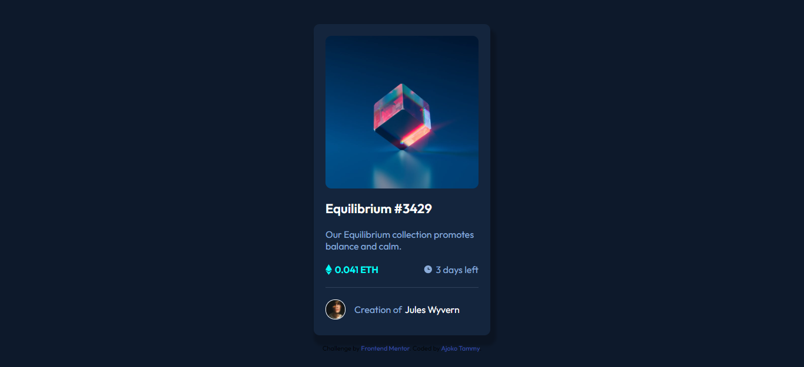

# Frontend Mentor - NFT preview card component solution

This is a solution to the [NFT preview card component challenge on Frontend Mentor](https://www.frontendmentor.io/challenges/nft-preview-card-component-SbdUL_w0U). Frontend Mentor challenges help you improve your coding skills by building realistic projects. 

## Table of contents

- [Overview](#overview)
  - [The challenge](#the-challenge)
  - [Screenshot](#screenshot)
  - [Links](#links)
  - [Built with](#built-with)
  - [What I learned](#what-i-learned)
  - [Continued development](#continued-development)
- [Author](#author)

## Overview

### The challenge

Users should be able to:

- View the optimal layout depending on their device's screen size
- See hover states for interactive elements

### Screenshot



### Links

- Solution URL: [Add solution URL here](https://your-solution-url.com)
- Live Site URL: [Add live site URL here](https://62edb8618fac9d5ffad77012--extraordinary-kitsune-5f694c.netlify.app/)

### Built with

- Semantic HTML5 markup
- CSS custom properties
- Flexbox
- Responsive Design

### What I learned

I learned how to create hover states on an image and also how to rotate an icon of which I added to the ethereum and clock icon

To see how you can add code snippets, see below:

```html
<h1>Some HTML code I'm proud of</h1>
```
```css
.hover-icon{
    position: absolute;
    top: 0;
    left: 0;
    width: 100%;
    height: 100%;
    background: hsla(178, 100%, 50%,0.6);
    display: flex;
    justify-content: center;
    align-items: center;
    opacity: 0;
    border-radius: 10px;
    transition: opacity 0.25s;
}
```

If you want more help with writing markdown, we'd recommend checking out [The Markdown Guide](https://www.markdownguide.org/) to learn more.

### Continued development

I'm learning how to pay closer attention to details and also making my site respomsive.I also want to improve on my code optimization and time consumption.

## Author

- Website - [Add your name here](https://www.your-site.com)
- Frontend Mentor - [@Tammy-Ajoko](https://www.frontendmentor.io/profile/Tammy-Ajoko)
- Twitter - [@tammy_dickson_](https://www.twitter.com/tammy_dickson_)