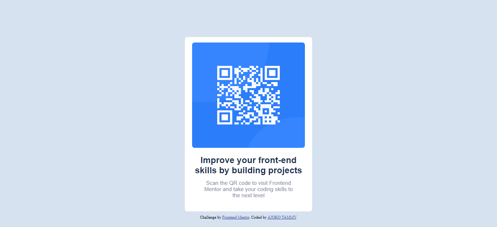

# Frontend Mentor - QR code component solution

This is a solution to the [QR code component challenge on Frontend Mentor](https://www.frontendmentor.io/challenges/qr-code-component-iux_sIO_H). Frontend Mentor challenges help you improve your coding skills by building realistic projects. 

## Table of contents

- [Overview](#overview)
  - [Screenshot](#screenshot)
- [My process](#my-process)
  - [Built with](#built-with)
  - [What I learned](#what-i-learned)
  - [Continued development](#continued-development)
- [Author](#author)


**Note: Delete this note and update the table of contents based on what sections you keep.**

## Overview

### Screenshot




## My process
  I started with my HTML and putting all the components into place, then i went ahead and created an external CSS file and linked it to my HTML where started styling form the top till i was satisfied with that section before moving on to the next.
### Built with

- Semantic HTML5 markup
- CSS custom properties
- Flexbox
- [Styled Components](https://styled-components.com/) - For styles


### What I learned


```html
<h2>Some HTML code I'm proud of</h2>
```
```css
.proud-of-this-css {
    diplay: flex;
}
```

### Continued development
I'd like to improve my attention to details


## Author

- Website - [Ajoko Tammy]
- Frontend Mentor - [@Tammy-Ajoko](https://www.frontendmentor.io/profile/Tammy-Ajoko)
- Twitter - [@tammy_dickson_](https://www.twitter.com/tammy_dickson_)